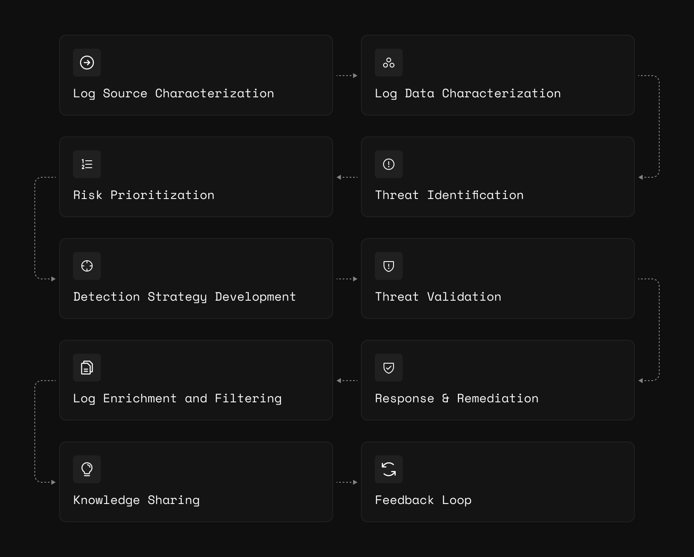

# Introducing Authac: The Art of Threat Modeling for Detection Engineering

# **Initial Motivations**

I’ve spent over ten years in the cybersecurity field. While I’ve delved into various specialties, my insatiable curiosity often led me to seek new challenges. Lately, I’ve found a deep enthusiasm for detection engineering.

Throughout my career, I’ve leveraged the knowledge of others to enhance my journey. Lately, that sentiment hasn’t changed. I operationalize threat research and intelligence of others to build detections.

There are many threat modeling frameworks in information security, and individuals use them to identify viable attack vectors, which leads to detection ideas.

While these frameworks support application security and software engineering use cases, more is needed for detection engineering. Some of the differences between these three domains are highlighted below.

| Aspect | Detection Engineering | Application Security | Software Engineering |
| --- | --- | --- | --- |
| Focus | Monitoring & Analysis | Vulnerability Prevention | Design, Implement, Test, Maintain |
| Primary Concern | Detecting Threats | Secure Code | Functional & Efficient Software |
| Tools & Techniques | SIEMs, Threat Intelligence, Behavioral Analytics | Static/Dynamic Code Analysis, Penetration Tests | IDEs, Version Control, Debugging Tools |
| End Goal | Threat Detection & Response | Attack-Resilient Software | Working software meeting user needs |

---

**Concerns and the Need for Clarity:**

Like many facets of cybersecurity, there are multiple issues in Detection Engineering. So, why address a threat modeling framework first?

> We needed a systematic way to identify, sort, and handle threats. This will make it easier for us to spot dangers, boost our effectiveness, improve our security, work better together, and stay ready for evolving threats. - Asante Babers

**The Solution?** **Authac**.

The roots of this framework stem from the one thing that detection engineers must have to operate: logs. By identifying and classifying log sources, we can outline potential attacks that an asset might be exposed to in a shareable model.

---

# **Summary**

Authac is a ten-step iterative process for threat modeling focused on log sources. I crafted this approach to aid detection engineers in identifying key data and sparking new ideas for detections. Unlike many other frameworks that use acronyms for their steps, the term “Authac” ("pronounced": aw-thak) is not an acronym. Instead, it’s a condensed version of a guiding principle for detection engineers: **to authenticate and authorize every action occurring within our organization.**

---

## **Objectives**

1. **Comprehensive Coverage**: Ensure detection for a broad range of threat scenarios.
2. **Prioritization**: Focus detections on highest likelihood and impactful threats.
3. **Proactive Approach**: Anticipate threats and set up detections and response strategies in advance.
4. **Validation Of Controls**: Assess and fill gaps in current security measures.
5. **Reduced False Positives**: Fine-tune detections to minimize false alarms.
6. **Improved Communication**: Foster unified understanding of threats among detection engineers.
7. **Continuous Improvement**: Regularly update threat models as risks develop.

---

## **Steps**

[1. Log Source Characterization](1_log_source_characterization.md) | [2. Log Data Characterization](2_log_data_characterization.md)

[3. Threat Identification](3_threat_identification.md) | [4. Risk Prioritization](4_risk_prioritization.md)

[5. Detection Strategy Development](5_detection_strategy_development.md) | [6. Threat Validation](6_threat_validation.md)

[7. Response & Remediation](7_response_and_remediation.md) | [8. Log Enrichment & Filtering](8_log_enrichment_and_filtering.md)

[9. Knowledge Sharing](9_knowledge_sharing.md) | [10. Feedback Loop](10_feedback_loop.md)